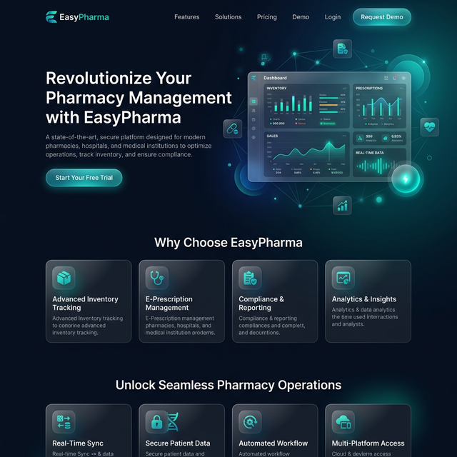

# 💊 EasyPharma Workspace

<!-- BADGES:START -->


<!-- BADGES:END -->

> **A secure, phase-locked, and resilient enterprise API and Client solution natively constructed in an Nx Monorepo.**

EasyPharma represents an absolute standard in architectural fidelity. Every component within is intentionally modular, inherently scalable, and explicitly secured for Enterprise deployment footprints.

---

## Project Progress

<!-- PROGRESS:START -->

| Phase 1 | Phase 2 | Phase 3 | Phase 4 | Phase 5 | Phase 6 | Phase 7 | Phase 8 |
| :-----: | :-----: | :-----: | :-----: | :-----: | :-----: | :-----: | :-----: |
|   ✅    |   ⬜    |   ⬜    |   ⬜    |   ⬜    |   ⬜    |   ⬜    |   ⬜    |

<!-- PROGRESS:END -->

---

## CI Pipeline Status

<!-- ACTIONS:START -->

| Workflow                                                                                                | Status                                                                                                                                  |
| ------------------------------------------------------------------------------------------------------- | --------------------------------------------------------------------------------------------------------------------------------------- |
| [**Release Automation**](https://github.com/preyan/EasyPharma/actions/workflows/release-automation.yml) |   |
| [**CI**](https://github.com/preyan/EasyPharma/actions/workflows/ci.yml)                                 |                        |
| [**Compliance & Docs**](https://github.com/preyan/EasyPharma/actions/workflows/ci-docs.yml)             |           |
| [**CodeQL**](https://github.com/preyan/EasyPharma/actions/workflows/codeql.yml)                         |                |
| [**Secret Scanning**](https://github.com/preyan/EasyPharma/actions/workflows/secret-scanning.yml)       |  |
| [**Coverage**](https://github.com/preyan/EasyPharma/actions/workflows/coverage.yml)                     |            |
| [**Broken Links**](https://github.com/preyan/EasyPharma/actions/workflows/broken-links.yml)             |           |
| [**Health Check**](https://github.com/preyan/EasyPharma/actions/workflows/health-check.yml)             |          |
| [**Stale Closer**](https://github.com/preyan/EasyPharma/actions/workflows/stale.yml)                    |                  |

<!-- ACTIONS:END -->

---

## Repository Stats

<!-- STATS:START -->
| Metric | Value |
|---|---|
| ⭐ Stars | 0 |
| 🐛 Open Issues | 40 |
| ✅ Closed Issues | 80 |
| 🔀 Merged PRs | 0 |
| 📝 Lines of Code | 458 |
<!-- STATS:END -->

---

## Key Features

### Enterprise-Grade Security

- **JWT & OIDC Authentication Contexts:** Centralized authorization via `@nestjs/passport` ensuring protected resource availability strictly based on trust.
- **Granular RBAC System:** Application-wide Role-Based Access Control enforcing specific domain access (Admin vs. Pharmacist) by declarative `@Roles()` decorators.
- **Swagger Bearer Authentication:** Built-in Swagger UI bearer token configuration out-of-the-box.

### Instant Front-End Reactivity

- **Zoneless Change Detection:** Next-generation Angular 21 rendering engine without Zone.js overhead (`ExperimentalZonelessChangeDetection` enabled for superior runtime performance).
- **NgRx Signal Stores:** Deep integration with Angular's reactive Signals primitive coupled with RxJS streams for real-world telemetry reporting.

### Production Reliability & UX

- **Interactive Demo Architectures:** Sandboxed UI layer with `@angular/cdk/overlay` guided tours.
- **SSR & Universal Hydration:** Improved Time-To-Interactive (TTI) indices resulting in maximum SEO footprints.
- **Exception Telemetry:** Centralized NestJS Exception Filtration and Angular global structural logging logic powered by Winston/Pino protocols.

---

## Visual Identity

EasyPharma features a high-end, premium aesthetic built with modern glassmorphism and a deep-space productivity theme.



_The landing page features a minimalist dark-mode dashboard, fluid gradients, and a responsive glassmorphism UI._

---

## Technology Stack

<!-- DEPS:START -->

| Package          | Version   |
| ---------------- | --------- |
| `@angular/core`  | `~21.1.0` |
| `@angular/cli`   | `~21.1.0` |
| `@nestjs/core`   | `^11.0.0` |
| `@prisma/client` | `^7.4.2`  |
| `nx`             | `22.5.3`  |
| `vitest`         | `^4.0.8`  |
| `typescript`     | `^5.9.3`  |

<!-- DEPS:END -->

---

## Coding Protocols

Our application runs entirely based on the following rules:

1.  **Zero-Error Threshold:** The application is blocked from committing if any compiler, test, or linting anomaly arises.
2.  **Library-First Domain Separation:** Features live inside `/libs` and are selectively exposed. The `api` and `client-web` app directories act solely as entry points to wire libraries together, enforcing decoupled architecture out of the box.
3.  **Audited Lifecycle Phases:** We follow a disciplined, 8-Phase sequence, validating and locking all modules in each phase prior to continuing.

---

## Quick Start

Ensure you have Node 22+ and pnpm installed natively.

1.  **Clone down the mono-repo stack:**

    ```bash
    git clone https://github.com/preyan/EasyPharma.git
    cd EasyPharma
    pnpm install
    ```

2.  **Generate Prisma ORM contexts:**

    ```bash
    npx prisma generate
    npx prisma db push
    ```

3.  **Commence Live Server Environments:**

    ```bash
    # Execute the Backend Router Gateway on :3000
    pnpm nx serve api

    # Execute the Angular Signal App on :4200
    pnpm nx serve client-web
    ```

4.  **Confirm Overall Workspace Health:**
    ```bash
    pnpm nx run-many -t lint test build
    ```

---

## Contributors

<!-- CONTRIBUTORS:START -->

<a href="https://github.com/preyan"></a>

<!-- CONTRIBUTORS:END -->

---

> _Developed under absolute zero-error threshold coding standards._
